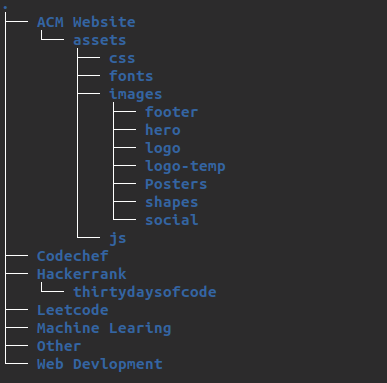

# **Hacktoberfest 2021**

Let's start contributing to Open Source . This repo is a beginner friendly repo where you can get started into your journey into opensource.

## **What is Hacktober Fest**

Hacktoberfest, in its 8th year, is a month-long celebration of open source software run by DigitalOcean. During the month of October, we invite you to join open-source software enthusiasts, beginners, and the developer community by contributing to open-source projects. You can do this in a variety of ways:

- Prepare and share your project for collaboration
- Contribute to the betterment of a project via pull requests
- Organize an event
- Mentor others
- Donate directly to open source projects

# Directory Structure

# happy hacking !!
